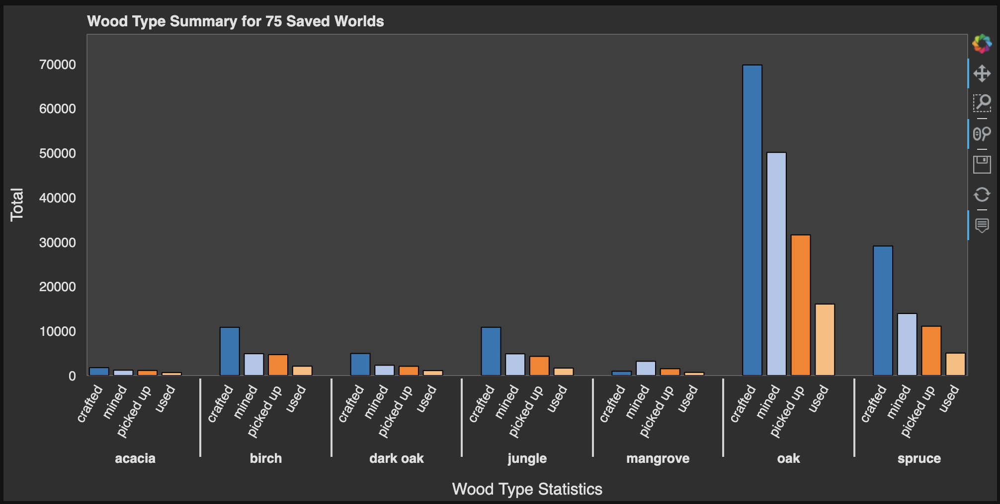

# MinecraftStats

Visualizing [statistics](https://minecraft.fandom.com/wiki/Statistics) and log file data from Minecraft Java Edition.
The [hvPlot](https://hvplot.holoviz.org/)  and the [Pandas API](https://hvplot.holoviz.org/user_guide/Pandas_API.html)
to summarize the data.  [Panel](https://panel.holoviz.org/index.html) is used to compile the html file.
